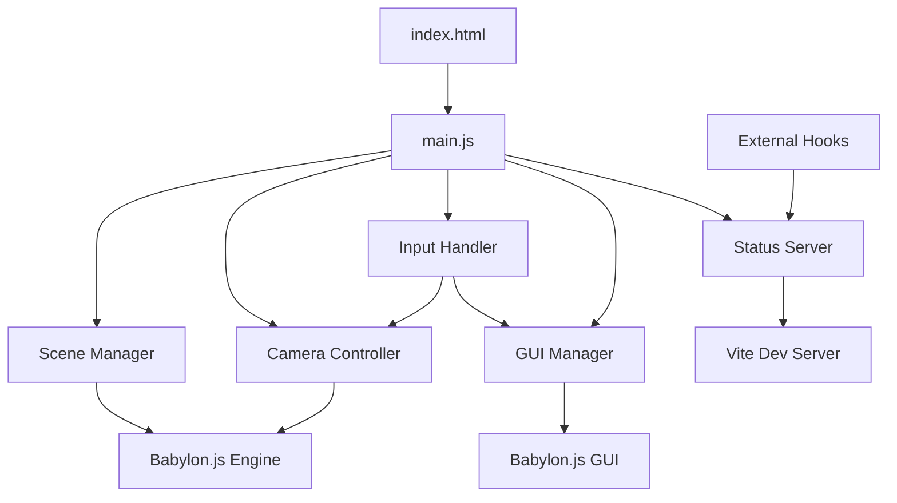

# Design Document

## Overview

The Babylon.js First-Person Spooky Game is a web-based 3D horror experience where players navigate a dark, atmospheric environment from a first-person perspective. The system includes a hidden developer mode (toggled with the G key) that allows the game creator to edit and place objects in the scene during development. The system uses Babylon.js for 3D rendering, Vite for build tooling, and implements a clean separation between rendering, input handling, scene management, and developer tools.

The architecture follows a modular design with distinct systems for camera control, scene setup, GUI management (developer-only), object manipulation, and health monitoring. The application runs entirely in the browser with no backend dependencies except for the status endpoint served by Vite.

**User Experience**: Players navigate a dark, eerie room using WASD keys and mouse look controls. The game creates a spooky atmosphere through dim lighting, dark colors, and an unsettling environment. The game is played in first-person view to maximize immersion and tension.

**Developer Experience**: While developing, pressing G toggles a GUI overlay that allows adding objects (boxes, spheres), selecting them by clicking, and editing their properties (position, color). This GUI is hidden by default and is a development tool, not part of the player experience.

## Architecture

### High-Level Architecture



### Module Responsibilities

**main.js (Entry Point)**
- Initialize Babylon.js engine and scene
- Coordinate all subsystems
- Set up render loop
- Handle application lifecycle

**SceneManager**
- Create and manage the room environment (floor, walls, ceiling)
- Add and remove scene objects
- Manage lighting
- Track all objects in the scene
- Provide object selection functionality

**CameraController**
- Manage first-person camera setup
- Handle WASD movement relative to camera direction
- Implement mouse look with pointer lock
- Maintain eye-level positioning
- Apply movement speed constants

**InputHandler**
- Listen for keyboard events (WASD, G key)
- Handle mouse events for object selection
- Manage pointer lock state
- Route input to appropriate controllers

**GUIManager**
- Create and manage Babylon.js GUI elements (developer mode only)
- Handle GUI visibility toggle (G key)
- Provide object creation buttons (box, sphere) for scene building
- Display property editors (position sliders, color picker) for selected objects
- Update GUI based on selected object during development
- Display FPS counter (always visible for performance monitoring)

**StatusServer**
- Expose /status endpoint via Vite middleware
- Track application state (active, error, stopped)
- Log and store error information
- Provide scene diagnostics (object count, rendering state)
- Format responses for automated health checks

## Components and Interfaces

### Core Components

#### Engine and Scene Setup

```javascript
// Engine initialization
const canvas = document.getElementById('renderCanvas');
const engine = new BABYLON.Engine(canvas, true);
const scene = new BABYLON.Scene(engine);

// Spooky atmosphere configuration
scene.clearColor = new BABYLON.Color3(0.02, 0.02, 0.05); // Very dark blue-black
scene.ambientColor = new BABYLON.Color3(0.1, 0.1, 0.15); // Dim ambient
scene.collisionsEnabled = false; // Simple movement without collision
```

#### Camera Controller

```javascript
class CameraController {
  constructor(scene, canvas) {
    this.scene = scene;
    this.canvas = canvas;
    this.camera = null;
    this.moveSpeed = 0.5;
    this.setupCamera();
    this.setupPointerLock();
  }

  setupCamera() {
    // Universal Camera for first-person controls
    this.camera = new BABYLON.UniversalCamera(
      "playerCamera",
      new BABYLON.Vector3(0, 1.6, -5), // Eye level at 1.6m
      this.scene
    );
    
    this.camera.attachControl(this.canvas, true);
    this.camera.speed = this.moveSpeed;
    this.camera.angularSensibility = 2000;
    
    // Set up WASD keys
    this.camera.keysUp = [87]; // W
    this.camera.keysDown = [83]; // S
    this.camera.keysLeft = [65]; // A
    this.camera.keysRight = [68]; // D
  }

  setupPointerLock() {
    // Request pointer lock on canvas click
    this.canvas.addEventListener('click', () => {
      this.canvas.requestPointerLock();
    });
  }

  getCamera() {
    return this.camera;
  }
}
```

#### Scene Manager

```javascript
class SceneManager {
  constructor(scene) {
    this.scene = scene;
    this.objects = [];
    this.selectedObject = null;
    this.setupRoom();
    this.setupLights();
    this.addPlaceholderObjects();
  }

  setupRoom() {
    // Floor - dark, worn appearance
    const floor = BABYLON.MeshBuilder.CreateGround(
      "floor",
      { width: 20, height: 20 },
      this.scene
    );
    const floorMat = new BABYLON.StandardMaterial("floorMat", this.scene);
    floorMat.diffuseColor = new BABYLON.Color3(0.15, 0.12, 0.1); // Dark brown
    floorMat.specularColor = new BABYLON.Color3(0.05, 0.05, 0.05); // Minimal shine
    floor.material = floorMat;

    // Walls (4 planes) - dark, oppressive
    const wallHeight = 5;
    const roomSize = 20;
    
    // Back wall
    const backWall = BABYLON.MeshBuilder.CreatePlane(
      "backWall",
      { width: roomSize, height: wallHeight },
      this.scene
    );
    backWall.position = new BABYLON.Vector3(0, wallHeight / 2, roomSize / 2);
    
    // Front wall
    const frontWall = BABYLON.MeshBuilder.CreatePlane(
      "frontWall",
      { width: roomSize, height: wallHeight },
      this.scene
    );
    frontWall.position = new BABYLON.Vector3(0, wallHeight / 2, -roomSize / 2);
    frontWall.rotation.y = Math.PI;
    
    // Left wall
    const leftWall = BABYLON.MeshBuilder.CreatePlane(
      "leftWall",
      { width: roomSize, height: wallHeight },
      this.scene
    );
    leftWall.position = new BABYLON.Vector3(-roomSize / 2, wallHeight / 2, 0);
    leftWall.rotation.y = Math.PI / 2;
    
    // Right wall
    const rightWall = BABYLON.MeshBuilder.CreatePlane(
      "rightWall",
      { width: roomSize, height: wallHeight },
      this.scene
    );
    rightWall.position = new BABYLON.Vector3(roomSize / 2, wallHeight / 2, 0);
    rightWall.rotation.y = -Math.PI / 2;

    // Apply spooky wall material - dark gray with slight green tint
    const wallMat = new BABYLON.StandardMaterial("wallMat", this.scene);
    wallMat.diffuseColor = new BABYLON.Color3(0.2, 0.25, 0.2); // Dark greenish-gray
    wallMat.specularColor = new BABYLON.Color3(0.1, 0.1, 0.1);
    [backWall, frontWall, leftWall, rightWall].forEach(wall => {
      wall.material = wallMat;
    });

    // Ceiling - very dark, barely visible
    const ceiling = BABYLON.MeshBuilder.CreateGround(
      "ceiling",
      { width: roomSize, height: roomSize },
      this.scene
    );
    ceiling.position.y = wallHeight;
    ceiling.rotation.z = Math.PI;
    const ceilingMat = new BABYLON.StandardMaterial("ceilingMat", this.scene);
    ceilingMat.diffuseColor = new BABYLON.Color3(0.1, 0.1, 0.12); // Almost black
    ceiling.material = ceilingMat;
  }

  setupLights() {
    // Very dim hemispheric light for minimal ambient lighting
    const hemiLight = new BABYLON.HemisphericLight(
      "hemiLight",
      new BABYLON.Vector3(0, 1, 0),
      this.scene
    );
    hemiLight.intensity = 0.15; // Very dim
    hemiLight.groundColor = new BABYLON.Color3(0.05, 0.05, 0.1); // Dark blue ground

    // Flickering point light for eerie atmosphere
    const pointLight = new BABYLON.PointLight(
      "pointLight",
      new BABYLON.Vector3(0, 4, 0),
      this.scene
    );
    pointLight.intensity = 0.3; // Dim, barely illuminating
    pointLight.diffuse = new BABYLON.Color3(0.8, 0.7, 0.5); // Sickly yellow-orange
    
    // Optional: Add flickering effect in render loop
    // pointLight.intensity = 0.3 + Math.random() * 0.1;
  }

  addPlaceholderObjects() {
    // Add a box
    this.addBox(new BABYLON.Vector3(-3, 1, 0));
    
    // Add a sphere
    this.addSphere(new BABYLON.Vector3(3, 1.5, 0));
  }

  addBox(position = new BABYLON.Vector3(0, 1, 0)) {
    const box = BABYLON.MeshBuilder.CreateBox(
      `box_${Date.now()}`,
      { size: 1 },
      this.scene
    );
    box.position = position;
    
    const material = new BABYLON.StandardMaterial(`boxMat_${Date.now()}`, this.scene);
    material.diffuseColor = new BABYLON.Color3(
      Math.random(),
      Math.random(),
      Math.random()
    );
    box.material = material;
    
    this.objects.push(box);
    return box;
  }

  addSphere(position = new BABYLON.Vector3(0, 1.5, 0)) {
    const sphere = BABYLON.MeshBuilder.CreateSphere(
      `sphere_${Date.now()}`,
      { diameter: 1 },
      this.scene
    );
    sphere.position = position;
    
    const material = new BABYLON.StandardMaterial(`sphereMat_${Date.now()}`, this.scene);
    material.diffuseColor = new BABYLON.Color3(
      Math.random(),
      Math.random(),
      Math.random()
    );
    sphere.material = material;
    
    this.objects.push(sphere);
    return sphere;
  }

  selectObject(mesh) {
    // Deselect previous
    if (this.selectedObject && this.selectedObject.material) {
      this.selectedObject.material.emissiveColor = new BABYLON.Color3(0, 0, 0);
    }
    
    // Select new
    this.selectedObject = mesh;
    if (mesh && mesh.material) {
      mesh.material.emissiveColor = new BABYLON.Color3(0.2, 0.2, 0);
    }
    
    return mesh;
  }

  getSelectedObject() {
    return this.selectedObject;
  }

  getObjects() {
    return this.objects;
  }
}
```

#### Input Handler

```javascript
class InputHandler {
  constructor(scene, canvas, guiManager, sceneManager) {
    this.scene = scene;
    this.canvas = canvas;
    this.guiManager = guiManager;
    this.sceneManager = sceneManager;
    this.setupKeyboardInput();
    this.setupMouseInput();
  }

  setupKeyboardInput() {
    window.addEventListener('keydown', (event) => {
      // Toggle GUI with G key
      if (event.key === 'g' || event.key === 'G') {
        this.guiManager.toggleVisibility();
      }
    });
  }

  setupMouseInput() {
    // Object selection on click
    this.scene.onPointerDown = (evt, pickResult) => {
      if (pickResult.hit && pickResult.pickedMesh) {
        const mesh = pickResult.pickedMesh;
        
        // Only select objects we've added (not room geometry)
        if (this.sceneManager.getObjects().includes(mesh)) {
          this.sceneManager.selectObject(mesh);
          this.guiManager.updateForSelectedObject(mesh);
        }
      }
    };
  }
}
```

#### GUI Manager

```javascript
class GUIManager {
  constructor(scene, sceneManager) {
    this.scene = scene;
    this.sceneManager = sceneManager;
    this.advancedTexture = null;
    this.mainPanel = null;
    this.isVisible = true;
    this.fpsText = null;
    this.selectedObject = null;
    
    this.setupGUI();
  }

  setupGUI() {
    // Create full screen GUI
    this.advancedTexture = BABYLON.GUI.AdvancedDynamicTexture.CreateFullscreenUI("UI");
    
    // Create main panel
    this.mainPanel = new BABYLON.GUI.StackPanel();
    this.mainPanel.width = "300px";
    this.mainPanel.horizontalAlignment = BABYLON.GUI.Control.HORIZONTAL_ALIGNMENT_RIGHT;
    this.mainPanel.verticalAlignment = BABYLON.GUI.Control.VERTICAL_ALIGNMENT_TOP;
    this.mainPanel.top = "10px";
    this.mainPanel.left = "-10px";
    this.advancedTexture.addControl(this.mainPanel);
    
    // Add object creation buttons
    this.createButton("Add Box", () => {
      this.sceneManager.addBox();
    });
    
    this.createButton("Add Sphere", () => {
      this.sceneManager.addSphere();
    });
    
    // Property editor section (initially empty)
    this.propertyPanel = new BABYLON.GUI.StackPanel();
    this.propertyPanel.width = "280px";
    this.mainPanel.addControl(this.propertyPanel);
    
    // FPS Counter (always visible)
    this.setupFPSCounter();
  }

  createButton(text, onClick) {
    const button = BABYLON.GUI.Button.CreateSimpleButton("btn", text);
    button.width = "280px";
    button.height = "40px";
    button.color = "white";
    button.background = "green";
    button.onPointerClickObservable.add(onClick);
    this.mainPanel.addControl(button);
    
    // Add spacing
    const spacer = new BABYLON.GUI.Container();
    spacer.height = "5px";
    this.mainPanel.addControl(spacer);
  }

  setupFPSCounter() {
    this.fpsText = new BABYLON.GUI.TextBlock();
    this.fpsText.text = "FPS: 0";
    this.fpsText.color = "white";
    this.fpsText.fontSize = 24;
    this.fpsText.textHorizontalAlignment = BABYLON.GUI.Control.HORIZONTAL_ALIGNMENT_LEFT;
    this.fpsText.textVerticalAlignment = BABYLON.GUI.Control.VERTICAL_ALIGNMENT_TOP;
    this.fpsText.top = "10px";
    this.fpsText.left = "10px";
    this.advancedTexture.addControl(this.fpsText);
  }

  updateFPS(fps) {
    if (this.fpsText) {
      this.fpsText.text = `FPS: ${fps.toFixed(0)}`;
    }
  }

  updateForSelectedObject(mesh) {
    this.selectedObject = mesh;
    
    // Clear existing property controls
    this.propertyPanel.clearControls();
    
    if (!mesh) return;
    
    // Add title
    const title = new BABYLON.GUI.TextBlock();
    title.text = "Selected Object";
    title.height = "30px";
    title.color = "white";
    this.propertyPanel.addControl(title);
    
    // Position sliders
    this.createSlider("X Position", mesh.position.x, -10, 10, (value) => {
      mesh.position.x = value;
    });
    
    this.createSlider("Y Position", mesh.position.y, 0, 5, (value) => {
      mesh.position.y = value;
    });
    
    this.createSlider("Z Position", mesh.position.z, -10, 10, (value) => {
      mesh.position.z = value;
    });
    
    // Color picker
    this.createColorPicker(mesh);
  }

  createSlider(label, initialValue, min, max, onChange) {
    const header = new BABYLON.GUI.TextBlock();
    header.text = label;
    header.height = "20px";
    header.color = "white";
    this.propertyPanel.addControl(header);
    
    const slider = new BABYLON.GUI.Slider();
    slider.minimum = min;
    slider.maximum = max;
    slider.value = initialValue;
    slider.height = "20px";
    slider.width = "260px";
    slider.color = "green";
    slider.background = "gray";
    slider.onValueChangedObservable.add(onChange);
    this.propertyPanel.addControl(slider);
    
    // Spacer
    const spacer = new BABYLON.GUI.Container();
    spacer.height = "5px";
    this.propertyPanel.addControl(spacer);
  }

  createColorPicker(mesh) {
    const header = new BABYLON.GUI.TextBlock();
    header.text = "Color";
    header.height = "20px";
    header.color = "white";
    this.propertyPanel.addControl(header);
    
    // Simple RGB sliders for color picking
    const currentColor = mesh.material.diffuseColor;
    
    this.createSlider("Red", currentColor.r, 0, 1, (value) => {
      mesh.material.diffuseColor.r = value;
    });
    
    this.createSlider("Green", currentColor.g, 0, 1, (value) => {
      mesh.material.diffuseColor.g = value;
    });
    
    this.createSlider("Blue", currentColor.b, 0, 1, (value) => {
      mesh.material.diffuseColor.b = value;
    });
  }

  toggleVisibility() {
    this.isVisible = !this.isVisible;
    this.mainPanel.isVisible = this.isVisible;
    // FPS counter stays visible
  }
}
```

#### Status Server (Vite Plugin)

```javascript
// vite.config.js plugin
function statusServerPlugin() {
  let appState = {
    status: 'active',
    errors: [],
    scene: {
      objectCount: 0,
      rendering: true
    },
    startTime: Date.now()
  };

  return {
    name: 'status-server',
    configureServer(server) {
      server.middlewares.use('/status', (req, res) => {
        res.setHeader('Content-Type', 'application/json');
        res.end(JSON.stringify({
          ...appState,
          uptime: Date.now() - appState.startTime,
          timestamp: new Date().toISOString()
        }));
      });
    }
  };
}

// In main.js, expose a way to update status
window.updateAppStatus = (updates) => {
  // This will be called to update scene info
  // Status is maintained in the Vite plugin
  fetch('/status/update', {
    method: 'POST',
    headers: { 'Content-Type': 'application/json' },
    body: JSON.stringify(updates)
  });
};
```

## Data Models

### Application State

```javascript
{
  engine: BABYLON.Engine,
  scene: BABYLON.Scene,
  cameraController: CameraController,
  sceneManager: SceneManager,
  guiManager: GUIManager,
  inputHandler: InputHandler
}
```

### Scene Object

```javascript
{
  mesh: BABYLON.Mesh,
  type: 'box' | 'sphere',
  position: BABYLON.Vector3,
  material: BABYLON.StandardMaterial,
  id: string
}
```

### Status Response

```javascript
{
  status: 'active' | 'error' | 'stopped',
  errors: Array<{
    message: string,
    timestamp: number,
    stack: string
  }>,
  scene: {
    objectCount: number,
    rendering: boolean,
    fps: number
  },
  uptime: number,
  timestamp: string
}
```

## Error Handling

### Global Error Catching

```javascript
// Catch and log all errors
window.addEventListener('error', (event) => {
  console.error('Application error:', event.error);
  updateAppStatus({
    status: 'error',
    errors: [{
      message: event.error.message,
      timestamp: Date.now(),
      stack: event.error.stack
    }]
  });
});

// Catch unhandled promise rejections
window.addEventListener('unhandledrejection', (event) => {
  console.error('Unhandled promise rejection:', event.reason);
  updateAppStatus({
    status: 'error',
    errors: [{
      message: event.reason.message || String(event.reason),
      timestamp: Date.now(),
      stack: event.reason.stack || ''
    }]
  });
});
```

### Babylon.js Error Handling

```javascript
// Scene error handling
scene.onErrorObservable.add((error) => {
  console.error('Scene error:', error);
  updateAppStatus({
    status: 'error',
    errors: [{
      message: error.message,
      timestamp: Date.now(),
      stack: ''
    }]
  });
});
```

### Graceful Degradation

- If GUI fails to initialize, log error but continue with basic rendering
- If pointer lock is denied, show message but allow keyboard movement
- If object creation fails, log error and continue
- Status endpoint returns last known state even if updates fail

## Testing Strategy

### Manual Testing Approach

Since this is a visual 3D application, testing will primarily be manual:

**Movement Testing**
- Verify WASD keys move camera in correct directions
- Test movement speed feels appropriate
- Confirm movement is relative to camera facing direction
- Check camera stays at eye level

**Mouse Look Testing**
- Verify pointer lock activates on canvas click
- Test smooth mouse movement in all directions
- Confirm no jitter or lag in camera rotation
- Test pitch limits prevent camera flipping

**GUI Testing**
- Press G key to toggle GUI visibility
- Verify Add Box button creates boxes
- Verify Add Sphere button creates spheres
- Test object selection by clicking
- Adjust position sliders and verify object moves
- Change color sliders and verify material updates
- Confirm FPS counter displays and updates

**Status Endpoint Testing**
- Navigate to http://localhost:5173/status
- Verify JSON response contains expected fields
- Trigger an error and check it appears in status
- Verify object count updates when adding objects

### Automated Testing (Optional)

If time permits, basic automated tests could include:

- Unit tests for utility functions (vector math, color conversions)
- Integration tests for status endpoint responses
- Smoke tests that verify the application loads without errors

### Performance Testing

- Monitor FPS counter during gameplay
- Add multiple objects and verify performance remains acceptable
- Check memory usage doesn't grow unbounded
- Verify no console errors during normal operation

## Implementation Notes

### Technology Choices

**Babylon.js**: Chosen for its comprehensive feature set, good documentation, and built-in GUI system. The UniversalCamera provides first-person controls out of the box.

**Vite**: Fast development server with hot module replacement. Easy to configure middleware for the status endpoint.

**No Framework**: Keeps the project simple and focused. All state management is explicit and easy to understand.

### Spooky Atmosphere Design

**Visual Elements**:
- Very dark color palette (blacks, dark grays, dark greens)
- Minimal lighting with dim, flickering point light
- Sickly yellow-orange light color for unsettling feel
- Dark blue-black background color
- Low specular values for matte, worn surfaces

**Potential Enhancements** (for future):
- Flickering light animation
- Fog for limited visibility
- Shadow casting for dramatic effect
- Ambient sound effects
- Particle effects (dust, mist)
- Random object placement for unpredictability

### Performance Considerations

- Use StandardMaterial instead of PBR materials for better performance
- Limit initial object count to keep scene simple
- No collision detection to avoid physics overhead
- Simple room geometry with minimal polygons
- GUI updates only when needed (on selection change)
- Dark colors reduce visual complexity and improve performance

### Browser Compatibility

- Requires WebGL 2.0 support
- Pointer Lock API required for mouse look
- Modern ES6+ JavaScript features used
- Tested in Chrome, Firefox, Edge

### Development Workflow

1. Run `npm install` to install dependencies
2. Run `npm run dev` to start Vite dev server
3. Open browser to http://localhost:5173
4. Make changes and see hot reload
5. Build for production with `npm run build`

### Future Enhancements (Out of Scope)

**Core Features**:
- Save/load scene functionality
- More object types (cylinders, tori, custom meshes)
- Texture support
- Lighting controls in GUI
- Undo/redo functionality
- Object deletion
- Camera position reset
- Collision detection
- Physics simulation

**Spooky Game Features**:
- Animated flickering lights
- Fog system for limited visibility
- Shadow casting for dramatic lighting
- Ambient sound effects and music
- Jump scares or surprise events
- Interactive objects (doors, switches)
- Enemy AI or moving entities
- Inventory system
- Story elements and objectives
- Multiple rooms or levels
